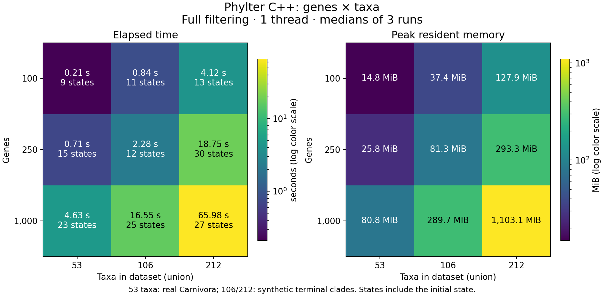

# Scaling with genes and tips — 2026-09-21

The native CLI was measured on **100, 250 and 1,000 genes**, each at
**53, 106 and 212 taxa**. All nine C++ workloads completed under a 3 GiB
address-space limit. The main memory requirement grows approximately as
**genes × taxa²**; full-analysis time also depends on convergence.



The figure is also available as [SVG](figures/tip-scaling.svg) and
[PDF](figures/tip-scaling.pdf). No scientific-engine changes were made.

## How the expanded trees were constructed

The real Carnivora archive and its original samples remain untouched. New
datasets are under `validation-data/carnivora-tip-scaling/`, ignored by Git.
The gene samples are nested selections without replacement from the 14,463-gene
archive, using the same source samples as the [real-data benchmark](BENCHMARK-REAL-CARNIVORA.md).

For each original tip, a terminal graft adds one or three synthetic relatives,
giving 2× or 4× the observed tip count. Grafts are balanced binary clades;
internal branch fractions and synthetic pendant lengths vary deterministically
by gene, using seed 20260922. Original tip names are retained. Synthetic names
such as `Gulo_gulo__synthetic001` are consistent across genes. At a fixed expansion
factor, the same source gene has exactly the same generated tree in every gene sample.

Original-to-original patristic distances are preserved. An independent check
using R/ape parsed all **4,050 trees** across the nine files and compared these
distances: maximum change **3.55e-15**. It also checked tip counts, label presence
and finite nonnegative branch lengths. Synthetic tips have positive pendant
lengths, rather than being exact zero-distance copies of existing tips.

**Taxon counts in this report are the union across genes**, and thus the matrix
dimension after imputation. Individual source genes contain 5–53 observed tips;
their expanded versions contain 10–106 or 20–212. A missing original taxon means
its entire synthetic clade is missing. DISTATIS receives equally sized matrices
within each analysis, just as in original R.

These are synthetic workload experiments, not independent new biological
observations or a test of biological filtering accuracy. The added taxa are
strongly related to their source taxa. A dataset with independently divergent
new taxa could have different factor counts, solver convergence and filtering
rounds. Distances between synthetic taxa are not held fixed between the 106-
and 212-taxon constructions; distances between original taxa are held fixed.

## Full filtering: measured results

Fresh sequential processes, one thread, same inputs and default scientific
parameters for R and C++: patristic distances, median normalization, cutoff
0.001, k = k2 = 3, row WR normalization, islands enabled, stop gain 1e-5,
support cutoff 0. C++ uses matrix-free RV and compact output without diagnostics.
No plots are generated during analysis.

C++ values are medians of **three runs**; R values are **one run per case**.
Times include startup, Newick reading, preparation, complete filtering and
compact output. RAM is maximum resident set size measured by GNU time.
R retains its normal richer in-memory result objects. Hardware is the same
Intel Core i7-1165G7 with nominal 16 GB RAM and sequential reference BLAS.

| Genes | Taxa | C++ time | Original R time | C++ peak RAM | R peak RAM | Accepted states |
| ---: | ---: | ---: | ---: | ---: | ---: | ---: |
| 100 | 53 | 0.21 s | 2.89 s | 14.8 MiB | 282.2 MiB | 9 |
| 100 | 106 | 0.84 s | 6.07 s | 37.4 MiB | 342.7 MiB | 11 |
| 100 | 212 | 4.12 s | 22.86 s | 127.9 MiB | 569.8 MiB | 13 |
| 250 | 53 | 0.71 s | 5.77 s | 25.8 MiB | 332.3 MiB | 15 |
| 250 | 106 | 2.28 s | 13.27 s | 81.3 MiB | 494.8 MiB | 12 |
| 250 | 212 | 18.75 s | 82.62 s | 293.3 MiB | 1,134.7 MiB | 30 |
| 1,000 | 53 | 4.63 s | 43.05 s | 80.8 MiB | 597.7 MiB | 23 |
| 1,000 | 106 | 16.55 s | 165.70 s | 289.7 MiB | 1,293.1 MiB | 25 |
| 1,000 | 212 | 65.98 s | Not attempted¹ | 1,103.1 MiB | — | 27 |

States include the initial state, so 27 states mean 26 accepted filtering rounds.
At 1,000 genes, C++ elapsed ranges were 4.47–4.63 s, 16.17–16.72 s and
65.71–67.07 s for 53, 106 and 212 taxa respectively. All three C++ runs in every
cell produced byte-identical score, outlier and discarded-entry files.

¹ R at 1,000 genes × 212 taxa was excluded by conservative memory screening
under the chosen **3 GiB process address-space budget**. This does not establish
that R cannot run that case on a larger-memory budget. Every launched run
completed normally; none hit the memory or 180-second wall-time limit. The
runner also required 5 GiB available before starting and stopped process groups
if available system memory fell below 2 GiB. No full 14,463-gene analysis ran.

## What the dimensions change

At **1,000 genes**, doubling taxa from 53 to 106 increased RAM **3.59×** and
runtime **3.57×**. Doubling again to 212 increased RAM **3.81×** and runtime
**3.99×**. This is close to quadratic growth once matrix storage dominates.

At **212 taxa**, increasing genes tenfold, from 100 to 1,000, increased peak
RAM **8.63×**, approaching linear growth after fixed overhead. Full runtime
increased **16.0×**, partly because accepted states increased from 13 to 27.
Another clear example is 250 genes: the 106→212 expansion increases states from
12 to 30, so runtime grows more than matrix dimensions alone would suggest.

In the code, distance/centered matrix storage is O(K N²), where K is gene count
and N is the taxon union. Each implicit RV multiplication is also O(K N²).
The compromise eigendecomposition still uses a dense O(N³) solver, and partial
projection work depends on the retained factor count as well as K and N.
Filtering repeats these operations. Thus **O(K N²) describes the main memory
cost, not a universal bound or fitted law for complete runtime**.

## Initialization separated from filtering rounds

Additional C++ measurements use `--initial-only`, with the same inputs,
three repetitions and the same resource limits. This includes startup,
reading trees, imputation, normalization and the first complete DISTATIS state
including projections. It excludes subsequent outlier-detection/filtering
rounds; it is not an isolated RV-kernel timing.

Median initial-pass elapsed times:

| Genes | 53 taxa | 106 taxa | 212 taxa |
| ---: | ---: | ---: | ---: |
| 100 | 0.08 s | 0.21 s | 0.72 s |
| 250 | 0.14 s | 0.49 s | 1.73 s |
| 1,000 | 0.50 s | 1.75 s | 6.81 s |

At 212 taxa, multiplying genes by ten increases this time **9.46×**, much
closer to linear than full filtering's 16× change. At 1,000 genes, doubling
taxa from 106 to 212 increases it **3.89×**, close to quadratic. Fixed overhead
is more visible at small sizes. Initial-pass peak RAM at 1,000 genes was
58.9, 203.7 and 758.9 MiB for 53, 106 and 212 taxa, respectively.
See the [initial-pass figure](figures/tip-scaling-initial.png).

The initial-only score is checked against the first full-analysis C++ score
in all nine cases and against original R's first score in all eight R-tested
cases. Original R is not rerun for these additional measurements. Lower
initial-only memory must not be used to size a complete filtering run.

## Original R correctness reference

The reference is original R **0.9.12**, `master` commit
`4d74241169be3882da9d5f08da47bd40604764eb`, explicitly loaded from
`.audit/reference-lib/phylter`. The optimized R branch is not used.
The native executable SHA256 is
`8d6b994899fc937e85ca530433f68f17e80f157994f190c16799c6e6dcf347d5`.

All **eight completed R/C++ comparisons** matched exact outlier gene/species
identities **and order**, discarded entries, accepted-state counts and every
accepted quality score. Maximum absolute quality difference: **1.33e-15**
(tolerance 1e-10). The 1,000-gene, 212-taxon case has repeatability checks but
**has not been compared against R** under this budget. These checks compare
compact scientific results and trajectories, not every intermediate matrix.

## Consequences for the full dataset on a laptop

The earlier positive laptop assessment was specifically for **53 taxa**.
Increasing the number of taxa changes that assessment substantially.

During a proposed filtering update, the current implementation keeps about
three full stacks of N × N matrices (current, proposed and centered proposed
matrices), plus projections, labels and other working arrays. At 14,463 genes:

| Taxa | Three matrix stacks alone | Approximate total from 1,000-gene RSS scaling |
| ---: | ---: | ---: |
| 53 | 0.91 GiB | 1.14 GiB |
| 106 | 3.63 GiB | 4.09 GiB |
| 212 | 14.53 GiB | 15.58 GiB |

The last column is an extrapolation, **not a full-run measurement or memory
guarantee**. At 53 taxa a laptop remains a reasonable target. At 106 taxa a
16 GB laptop may work if sufficient RAM is free, but an 8 GB machine would
have much less room. At 212 taxa, **do not plan a full 14,463-gene run on a
16 GB laptop**: the main matrices alone consume almost its entire usable RAM.
These estimates assume one thread, default matrix-free RV and compact output.
Dense RV or diagnostics incur additional quadratic-in-gene storage.

## Reproduction and changing the dimensions

From the parent R repository, choose fresh directories:

```sh
# Generate synthetic inputs, preserving the original data.
python3 tests/expand-carnivora-tips.py \
  --genes 100 250 1000 --factors 1 2 4 \
  --output validation-data/new-tip-grid

# Independently verify the grafts with ape.
TMPDIR="$PWD/.audit/tmp" R_LIBS="$PWD/.audit/reference-lib:$PWD/.audit/library" \
  Rscript --vanilla tests/check-expanded-tips.R \
  validation-data validation-data/new-tip-grid

# Full analysis and R reference comparisons under memory/time limits.
python3 tests/benchmark-tip-scaling.py \
  build/new-tip-grid --data validation-data/new-tip-grid

# Initial-pass timings, checked against the preceding full-analysis scores.
python3 tests/benchmark-tip-scaling.py \
  build/new-tip-grid-initial --data validation-data/new-tip-grid \
  --initial-only --r-repeats 0 --reference-results build/new-tip-grid

python3 -B tests/plot-tip-scaling.py build/new-tip-grid
```

Factors multiply the original 53-taxon union: **1 → 53, 2 → 106, 4 → 212,
8 → 424**. Larger factors can be generated without launching an analysis;
the benchmark's screening and hard memory limits still apply. Gene counts
must have prepared `sample-K.nwk` source files (currently 100, 250, 1,000 and
3,000). These Python/R helpers are developer tools, not CLI runtime dependencies.

Raw full-run measurements are in `build/tip-scaling/`; initial-pass measurements
are in `build/tip-scaling-initial/`. Both contain `runs.tsv`, `summary.json`,
`environment.json`, result files and logs. Input hashes, generation provenance
and gene-to-archive mappings are saved with the generated datasets.

To use one of the generated datasets directly:

```sh
build/phylter run \
  --trees validation-data/carnivora-tip-scaling/tips-106/sample-250.nwk \
  --out build/my-expanded-result --threads 1
```
